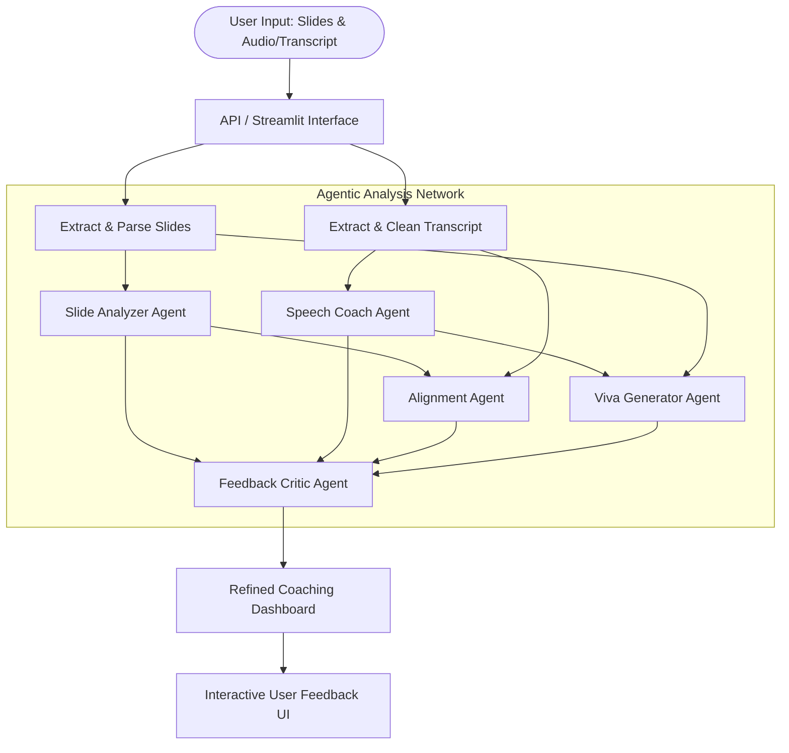

# System Architecture: PitchPilot Agentic AI Presentation Coach

This document details the system design, agent interactions, and technical workflows of the PitchPilot presentation coaching platform.

---

## 🏛️ Overall System Architecture

PitchPilot utilizes a stateful multi-agent orchestrator built with LangGraph. The orchestration pattern ensures that different analytical tasks run in parallel or sequence, and their outputs are critically audited before being displayed to the user.



---

## 🤖 Agent Roles & Specifications

### 1. Slide Analyzer Agent (`slide_analyzer.py`)
*   **Input:** Structured text per slide.
*   **Responsibilities:**
    *   Assess readability indices (e.g., Flesch-Kincaid) of slide content.
    *   Check for the "6x6 Rule" (no more than 6 bullet points per slide, 6 words per bullet).
    *   Analyze visual-to-text balance and suggest where charts, icons, or diagrams would improve engagement.
*   **Output:** Slide-wise content score and specific recommendations.

### 2. Speech Coach Agent (`speech_analyzer.py`)
*   **Input:** Raw presentation transcript and optional audio timing data.
*   **Responsibilities:**
    *   Calculate pacing metrics (Words Per Minute - WPM). Recommended range: 130–150 WPM.
    *   Scan for filler words using regex and string distance algorithms (e.g., "um", "uh", "like", "so", "actually", "basically").
    *   Evaluate structural storytelling (Presence of clear hook, body, call-to-action).
*   **Output:** Pacing stats, filler word frequency map, and verbal delivery feedback.

### 3. Alignment Agent (`alignment_analyzer.py`)
*   **Input:** Slide text and Speech transcript.
*   **Responsibilities:**
    *   Segment the transcript and align it with the corresponding slides.
    *   Use a Sentence-Transformer model (e.g., `all-MiniLM-L6-v2`) to embed slide content and spoken transcript segments.
    *   Compute Cosine Similarity to find alignment scores (0.0 to 1.0) for each slide.
    *   Identify "Unspoken Slide Content" (key points on the slide that were completely ignored) and "Improvisation/Deviation" (spoken content not represented on the slide).
*   **Output:** Slide-by-slide semantic alignment score and omission reports.

### 4. Viva Generator Agent (`viva_generator.py`)
*   **Input:** Slide content and speech transcript.
*   **Responsibilities:**
    *   Extract the core claims, methodology, results, and limitations of the presented project.
    *   Formulate academic/professional questions that examiners, venture capitalists, or managers are likely to ask.
    *   Provide model answers and prompt the presenter to test themselves.
*   **Output:** List of 5–10 customized viva questions with suggested answering strategies.

### 5. Feedback Critic Agent (`feedback_critic.py`)
*   **Input:** Compiled feedback from all prior agents.
*   **Responsibilities:**
    *   Audit outputs for contradictions (e.g., Slide Analyzer saying "Add more details about X" while Speech Coach says "You spent too much time detailing X").
    *   Refine tone to be constructive, professional, and encouraging (Human-Centered AI design).
    *   Order suggestions by impact (Critical fixes vs. nice-to-haves).
*   **Output:** Consolidated, vetted, and formatted coaching report.

---

## 🔄 Stateful LangGraph Design

The agents share a global application state (`PresentationState`):

```python
from typing import TypedDict, List, Dict, Any

class PresentationState(TypedDict):
    slide_text: str                     # Raw or structured slide text
    transcript: str                     # Raw spoken transcript
    slide_analysis: Dict[str, Any]      # Feedbacks from Slide Analyzer
    speech_analysis: Dict[str, Any]     # Feedbacks from Speech Coach
    alignment_scores: List[float]       # Slide-speech semantic alignment indices
    viva_questions: List[Dict[str, Any]]# Generated viva Q&A
    final_feedback: str                 # Critiqued and consolidated output
```

The execution flow starts with parallel nodes for Slide and Speech analysis, followed by Alignment and Viva generation nodes, culminating in the Critic node.
